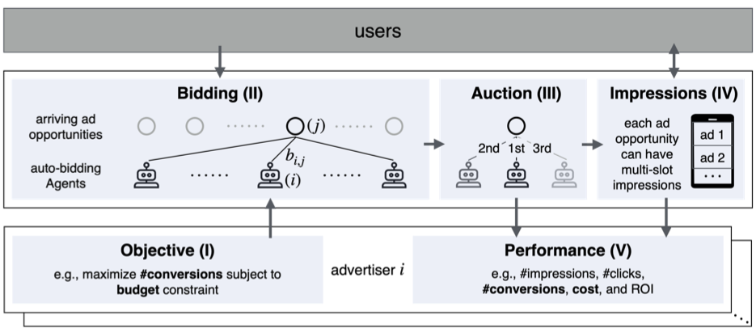

# AuctionNet: A Novel Benchmark for Decision-Making in Large-Scale Games
   &nbsp;&nbsp;&nbsp;&nbsp;  &nbsp;&nbsp;&nbsp;&nbsp;  &nbsp;&nbsp;&nbsp;&nbsp;  


---


[//]: # (<p align="center">)

[//]: # (<a href="https://openreview.net/forum?id=OTjTKFk7gb#discussion">Paper</a>)

[//]: # (</p>)

Decision-making in large-scale games is an essential research area in artificial intelligence (AI) with significant real-world impact. **AuctionNet** is a benchmark for bid decision-making in large-scale ad auctions derived from a real-world online advertising platform. AuctionNet is composed of three parts: 

- 🌏️ **Ad Auction Environment**: The environment effectively replicates the integrity and complexity of real-world ad auctions with the interaction of several modules: the ad opportunity generation module, the bidding module, and the auction module. 

- 🔢 **Pre-Generated Dataset**: We pre-generated a substantial dataset based on the auction environment. The dataset contains trajectories with 48 diverse agents competing with each other, totaling over 500 million records and 80GB in size.

- ✴️ **Several Baseline Bid Decision-Making Algorithms**: We implemented a variety of baseline algorithms such as linear programming, reinforcement learning, and generative models.

We note that AuctionNet is applicable not only to research on bid decision-making algorithms in ad auctions but also to the general area of **decision-making** in large-scale games. It can also benefit researchers in a broader range of areas such as reinforcement learning, generative models, operational research, and mechanism design.

## 🔥 News

---

- [**2024-12-14**] 🔥 The **AuctionNet-1.0** code has been officially open-sourced. We welcome everyone to give it a thumbs up and share valuable feedback.
- [**2024-10-24**] 💫  [NeurIPS 2024 Competition: Auto-Bidding in Large-Scale Auctions](https://tianchi.aliyun.com/competition/entrance/532226) has officially ended. The competition attracted more than **1,500 teams** to participate. The **auction environment for evaluation, dataset, baseline algorithms** used in the competition are derived from this project.
- [**2024-09-26**] 🎁 Our paper [AuctionNet](https://openreview.net/forum?id=OTjTKFk7gb#discussion) has been accepted by **NeurIPS 2024 Datasets and Benchmark Track**!

## 🥁 Background
<p align="center">
    <br>
    
    <br>
</p>

Bid decision-making in large-scale ad auctions is a concrete example of decision-making in large-scale games.  
Numbers 1 through 5 illustrate how an auto-bidding agent helps advertisers optimize performance.  
For each advertiser's unique objective (I), the auto-bidding agent makes bid decision-making (II) for continuously arriving ad opportunities and competes against each other in the ad auction (III).  
Then, each agent may win some impressions (IV), which may be exposed to users and potentially result in conversions. Finally, the agents' performance (V) will be reported to advertisers.


## 🏛︎ Project Structure

---

```
├── config                        # Configuration files for setting up the hyperparameters.
├── main_test.py                  # Main entry point for running evaluations.
├── run                           # Core logic for executing tests.

├── simul_bidding_env             # Ad Auction Environment

│   ├── Controller                # Module controlling the simulation flow and logic.
│   ├── Environment               # The auction module.
│   ├── PvGenerator               # The ad opportunity generation module.
│   ├── Tracker                   # Tracking components for monitoring and analysis.
│   │   ├── BiddingTracker.py     # Tracks the bidding process and generates raw data on ad opportunities granularity.
│   │   ├── PlayerAnalysis.py     # Implements metrics to evaluate the performance of user-defined strategies.
│   └── strategy                  # The bidding module (competitors’ strategies).


├── pre_generated_dataset         # Pre-generated dataset.


├── strategy_train_env            # Several baseline bid decision-making algorithms.

│   ├── README_strategy_train.md  # Documentation on how to train the bidding strategy.
│   ├── bidding_train_env         # Core components for training bidding strategies.
│   │   ├── baseline              # Implementation of baseline bid decision-making algorithms.
│   │   ├── common                # Common utilities used across modules.
│   │   ├── train_data_generator  # Reads raw data and constructs training datasets.
│   │   ├── offline_eval          # Components required for offline evaluation.
│   │   └── strategy              # Unified bidding strategy interface.
│   ├── data                      # Directory for storing training data.
│   ├── main                      # Main scripts for executing training processes.
│   ├── run                       # Core logic for executing training processes.
│   ├── saved_model               # Directory for saving trained models.

```


## 🧑‍💻 Quickstart

---

### Create and activate conda environment
```bash
$ conda create -n AuctionNet python=3.9.12 pip=23.0.1
$ conda activate AuctionNet
```
### Install requirements
```bash
$ pip install -r requirements.txt
```

### Train Strategy & Offline Evaluation
*For detailed usage, please refer to `strategy_train_env/README_strategy_train.md`.*

```
cd strategy_train_env  # Enter the strategy_train directory
```
#### Data Processing
Run this script to convert the raw data on ad opportunities granularity into trajectory data required for model training.
```
python  bidding_train_env/train_data_generator/train_data_generator.py
```

#### Strategy Training
Load the training data and train the xxx (for example, IQL) bidding strategy.
```
python main/main_iql.py 
```

Use the xxxBiddingStrategy as the PlayerBiddingStrategy for evaluation.
```
bidding_train_env/strategy/__init__.py
from .iql_bidding_strategy import IqlBiddingStrategy as PlayerBiddingStrategy
```

#### Offline Evaluation
Load the raw data on ad opportunities granularity to construct an offline evaluation environment for assessing the bidding strategy offline.
```
python main/main_test.py
```

### Online Evaluation
Set up the hyperparameters for the online evaluation process.
```
config/test.gin
```

Run online evaluation.
```bash
# Return to the root directory
$ python main_test.py
```

## 📖 User Case
### Train your own bidding strategy 'awesome_xx'
Refer to the baseline algorithm implementation and complete the following files.
```
├── strategy_train_env
│   ├── bidding_train_env
│   │   ├── baseline
│   │   │   └── awesome_xx
│   │   │       └──awesome_xx.py                # Implement model-related components.
│   │   ├── train_data_generator
│   │   │   └── train_data_generator.py         # Custom-built training Data generation Pipeline.
│   │   └── strategy
│   │       └── awesome_xx_bidding_strategy.py  # Implement Unified bidding strategy interface.
│   ├── main
│   │   └── main_awesome_xx.py                  # Main scripts for executing training processes.
│   └── run
│       └── run_awesome_xx.py                   # Core logic for executing training processes.

```
### Evaluate your own bidding strategy 'awesome_xx'
Use the awesome_xxBiddingStrategy as the PlayerBiddingStrategy for evaluation.
```
bidding_train_env/strategy/__init__.py
from .awesome_xx_bidding_strategy import awesome_xxBiddingStrategy as PlayerBiddingStrategy
```
Run the evaluation process.
```
# Return to the root directory
$ python main_test.py
```


### Generate new dataset
Set the hyperparameters and run the evaluation process.
```
config/test.gin
GENERATE_LOG = True

python main_test.py
```
The newly generated data will be stored in the /data folder.


### Customize new auction environment
We adhere to the programming principles of high cohesion and low coupling to encapsulate each module, making it convenient for users to modify various modules in the auction environment according to their needs.
```
├── simul_bidding_env             # Ad Auction Environment

│   ├── Environment               # The auction module.
│   ├── PvGenerator               # The ad opportunity generation module.
│   ├── Tracker                   
│   │   ├── PlayerAnalysis.py     # Implements metrics to evaluate the performance.
│   └── strategy                  # The bidding module (competitors’ strategies).
```


## 🎡 Implemented Bid Decision-Making Algorithms

---

| Category                  | Strategy                                     | Status |
|---------------------------|----------------------------------------------|--------|
| Reinforcement Learning    | [IQL](https://arxiv.org/abs/2110.06169)      |   ✅     |
|                           | [BC](https://arxiv.org/abs/1805.01954)       |   ✅    |
|                           | [BCQ](https://arxiv.org/pdf/1812.02900)      | ✅      |
|                           | [TD3_BC](https://arxiv.org/pdf/2106.06860)   | ✅      |
| Online Linear Programming | [OnlineLp](https://arxiv.org/abs/2006.16312) | ✅      |
| Generative Model          | [Decision-Transformer](https://arxiv.org/abs/2106.01345)                     | ✅      |
| Generative Model          | [Diffbid](https://arxiv.org/pdf/2405.16141)  | To be implemented    |
| Other                     | Abid (fixed bid rate)                        | ✅      |
|                           | [PID](https://arxiv.org/abs/1603.01055)      | ✅      |


## ✌ Contributing

---

The field of decision intelligence is a fascinating area, and we welcome like-minded individuals to contribute their wisdom and creativity to optimize this project. If you have great ideas, feel free to fork the repo and create a pull request.

1. Fork the project.
2. Create your feature branch (`git checkout -b new-branch`).
3. Commit your changes (`git commit -m 'Add some feature'`).
4. Push to the branch (`git push origin new-branch`).
5. Open a pull request.

## 🏷️ License

---

Distributed under the Apache License 2.0. See `LICENSE.txt` for more information.

## 💓 Reference

---

- [CleanDiffuser](https://github.com/CleanDiffuserTeam/CleanDiffuser)
- [Hands-on-RL](https://github.com/boyu-ai/Hands-on-RL)


## 🧑‍🤝‍🧑 Contributors

---

Shuai Dou • Yusen Huo • Zhilin Zhang • Yeshu Li • Zhengye Han • Kefan Su  
 • Zongqing Lu • Chuan Yu • Jian Xu • Bo Zheng


## ✉️ Contact

---

For any questions, please feel free to email `doushuai.ds@taobao.com`.


## 📝 Citation

---

If you find our work useful, please consider citing:
```
@inproceedings{
su2024a,
title={A Novel Benchmark for Decision-Making in Uncertain and Competitive Games},
author={Kefan Su and Yusen Huo and Zhilin Zhang and Shuai Dou and Chuan Yu and Jian Xu and Zongqing Lu and Bo Zheng},
booktitle={The Thirty-eight Conference on Neural Information Processing Systems Datasets and Benchmarks Track},
year={2024},
url={https://openreview.net/forum?id=OTjTKFk7gb}
}
```