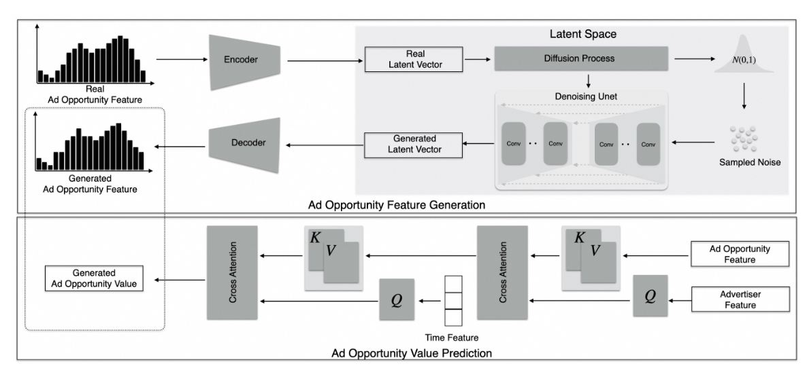

This module is responsible for the training of the ad opportunity generation module. The target of the ad opportunity generation module is to generate diverse ad opportunities similar to real online advertising data. The core of this module is the deep generative model, as shown in the following figure.
<p align="center">
    <br>
    
    <br>
<p>


# File Structure

File structure under `train_generation_module`:

```
train_generation_module
|── data                      # Example data for model training.
|── models
    |—— diffusion.py          # Definition of the LDM model.
    |—— PvModel.py            # Definition of the value prediction model.
    |—— model_utils.py        # Module for building the model and other utility functions.
|── stats_useful              # Auxiliary data used for data processing.
|── utils.py                  # Utility functions for the process of training and evaluation. 
|── train.py                  # The script for training components of the impression generation module, including the LDM for ad opportunity generation and value prediction model.

```

# 🧑‍💻Quickstart

---

### Train Latent Diffusion Model for Ad Opportunity Features
```
python train_generation_module/train.py --algo_name diffusion
```

The model will be saved at the path 'train_generation_module/checkpoint'.

### Train Value Predicition Model

```
python train_generation_module/train.py --algo_name Pv
```
The model will be saved at the path 'train_generation_module/checkpoint'.
